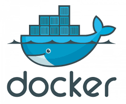

# Portfolio — Application Dockerisée



Un projet full‑stack (API Node/Express + frontend React) conteneurisé avec Docker et orchestré via Docker Compose. Permet de lister, ajouter, modifier et supprimer des projets de portfolio, avec upload d'images.

## Principaux éléments

- Frontend : React + Vite (port 5173)
- Backend : Node.js + Express (port 3000)
- Base de données : MongoDB (port exposé localement 27018)
- Orchestration : Docker Compose

## Démarrage (Docker)

1. Cloner le dépôt

```bash
git clone <URL_DU_DEPOT>
cd PROJET_DOCKER
```

2. Lancer tous les services

```bash
docker compose up --build
```

3. Accéder

- Frontend : http://localhost:5173
- Backend API : http://localhost:3000 (base : /api/projects)

Arrêter et supprimer volumes (optionnel) :

```bash
docker compose down -v
```

## Scripts utiles

- Backend (dans `portfolio-api`) : `npm run start` (ou `npm run dev` si `nodemon` installé)
- Frontend (dans `portfolio-react`) : `npm run dev` (vite)

## Variables d'environnement

Exemple pour le backend (`portfolio-api/.env` — fourni en exemple dans le repo) :

```
PORT=3000
MONGO_URI=mongodb://mongodb:27017/portfolio
```

> En Docker Compose, `MONGO_URI` est configuré pour utiliser le service `mongodb`.

## Routes API principales

- `GET /api/projects` — lister tous les projets
- `GET /api/projects/:id` — obtenir un projet
- `POST /api/projects` — créer un projet (multipart/form-data pour l'image)
- `PUT /api/projects/:id` — modifier
- `DELETE /api/projects/:id` — supprimer

## Fonctionnalités importantes

- Upload d'images avec `multer` stockées dans le volume `uploads_data`.
- Connexion à MongoDB via `mongoose`.

## Structure du dépôt

- `docker-compose.yml` — orchestration des services
- `portfolio-api/` — backend (Express)
- `portfolio-react/` — frontend (React + Vite)

## Développement local (sans Docker)

Backend :

```bash
cd portfolio-api
npm install
npm run dev
```

Frontend :

```bash
cd portfolio-react
npm install
npm run dev
```

## Commit & contribution

Ce repo contient un `.gitignore` adapté (exclut `node_modules`, `.env`, `uploads/`). Pour proposer des changements, ouvrez une branche, ajoutez vos commits et soumettez une Pull Request.

## Auteur

Projet réalisé dans le cadre d'une formation. Usage éducatif.
